# Лабораторная работа №14-16 - Интернет-магазин "TechStore"

ФИО: Федотова Виктория Сергеевна
Группа: ИСП-232
Дата: 02.03.2026

## Описание проекта

Многостраничный сайт интернет-магазина электроники "TechStore" с адаптивной
вёрсткой.

## Реализованные страницы

- Главная — приветственный баннер, популярные товары, преимущества
- Каталог — сетка из 9 карточек товаров с фильтрами
- О нас — информация о магазине и команде

## Реализованные функции

- Адаптивное навигационное меню
- Карточки товаров с hover-эффектами
- CSS Grid для каталога (3 колонки)
- Flexbox для навигации и футера
- Адаптивная вёрстка (desktop/tablet/mobile)
- Единая цветовая схема и типографика
- Семантическая HTML5-разметка

## Технологии

- HTML5
- CSS3 (Flexbox, Grid, Media Queries)
- Git/GitHub

## Скриншоты

- Главная страница

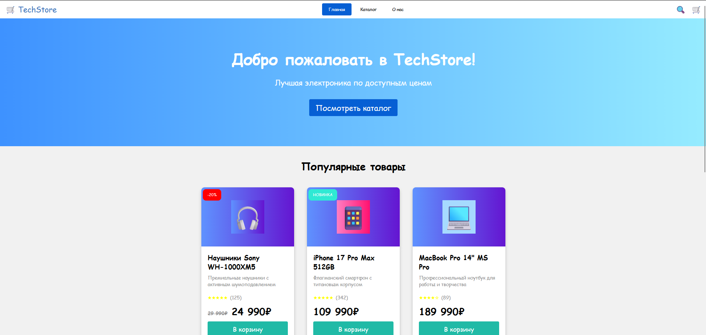
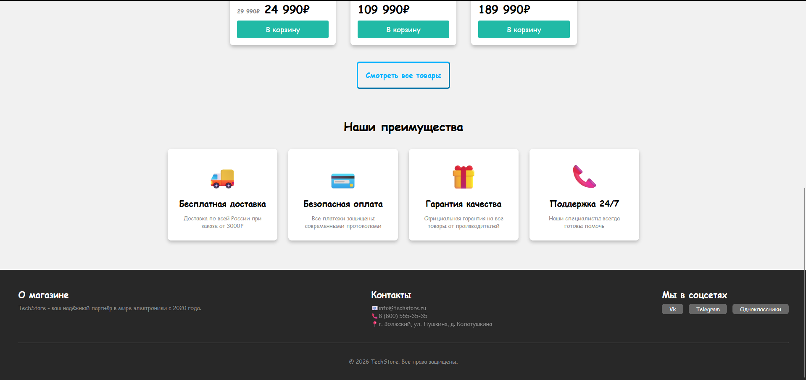

- Каталог товаров

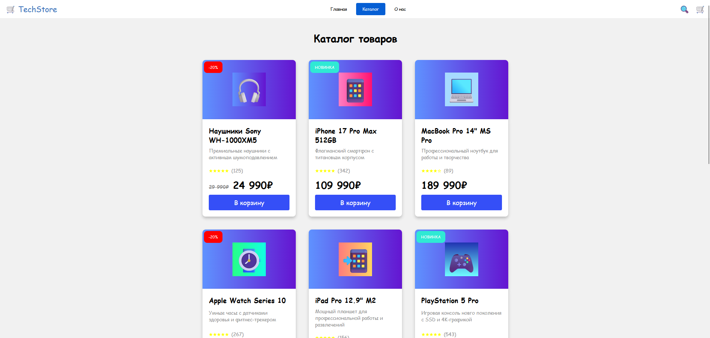
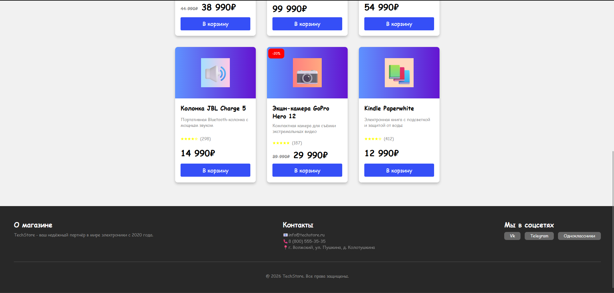

- О нас

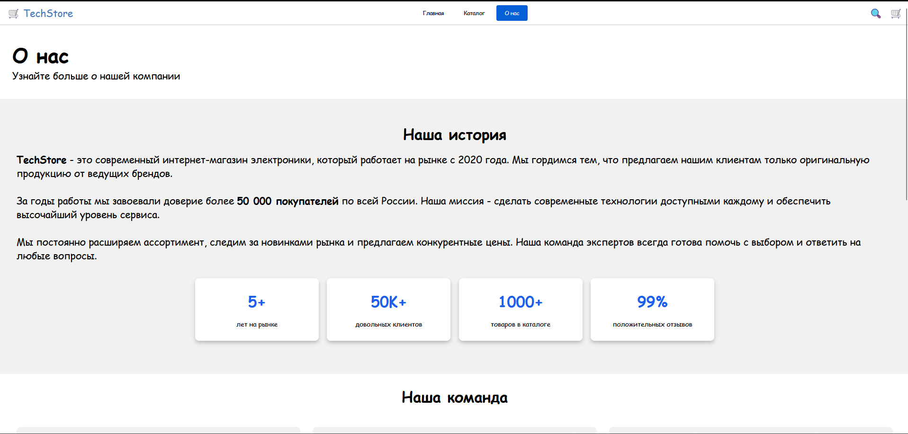
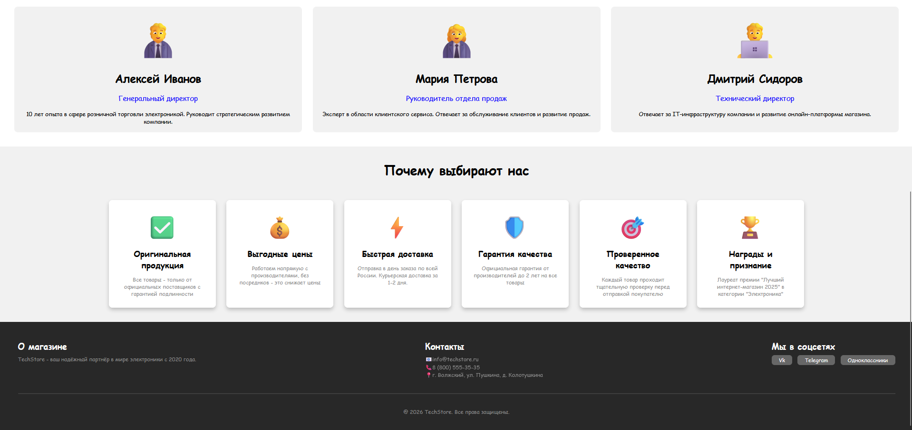

- Мобильная версия страниц

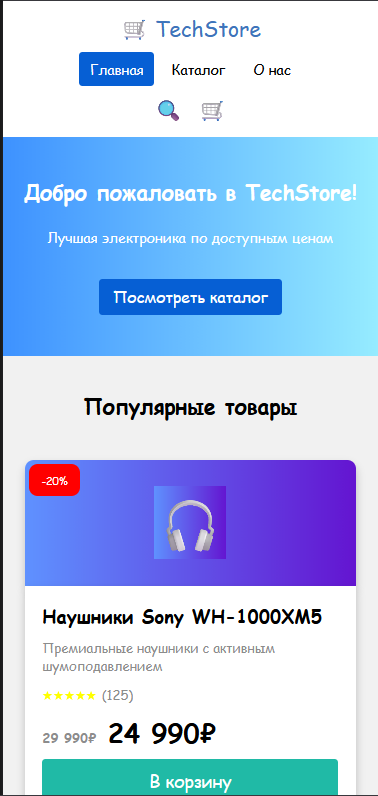
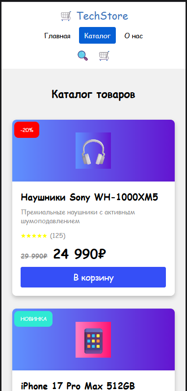
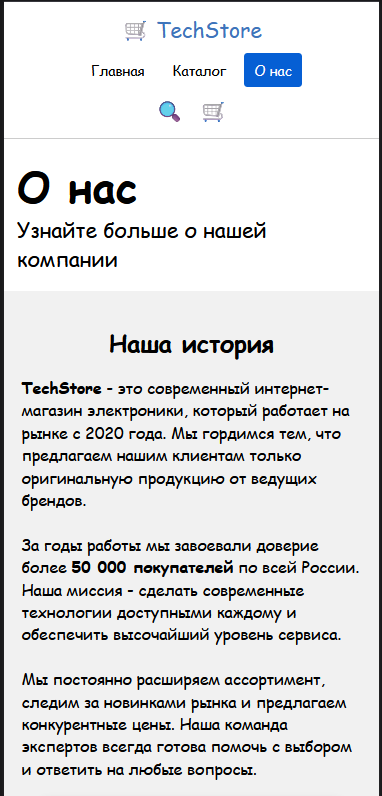

- Планшетная версия страниц

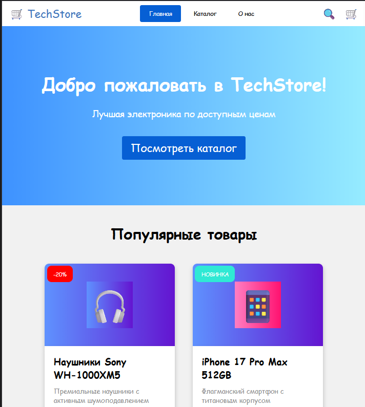
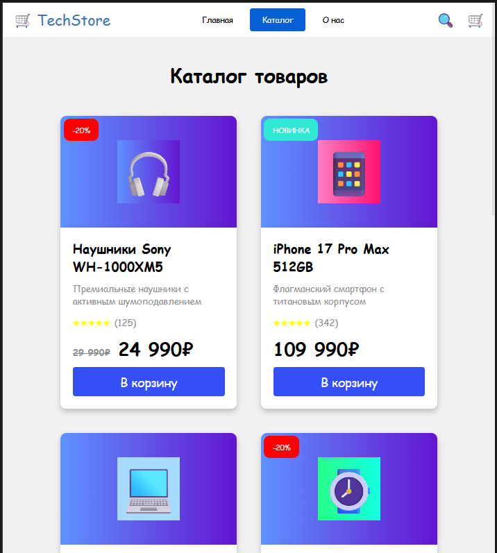
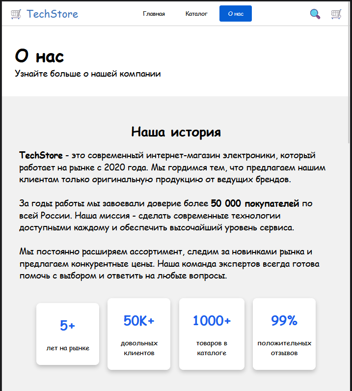
